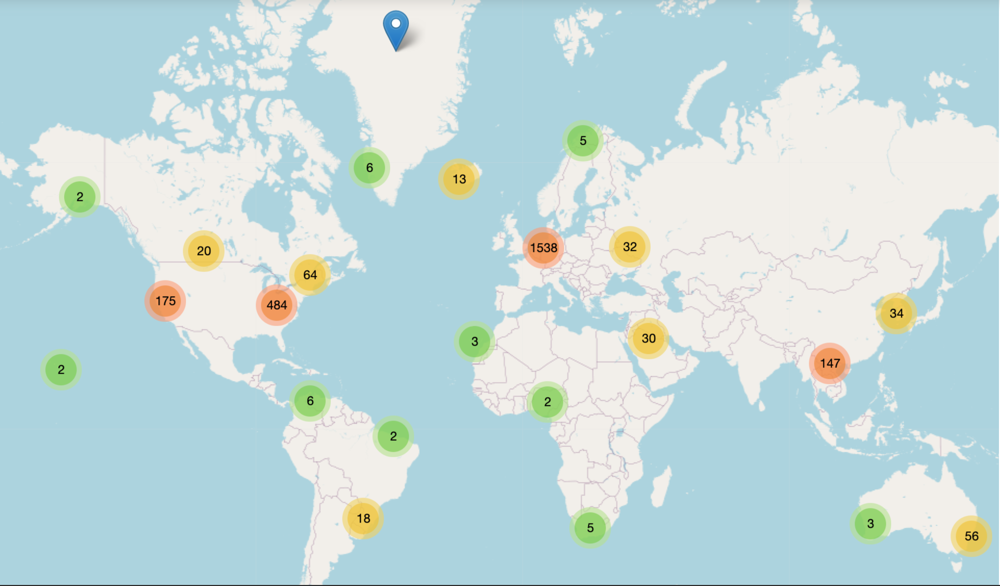
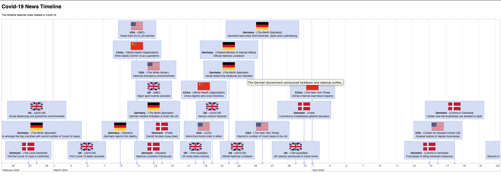
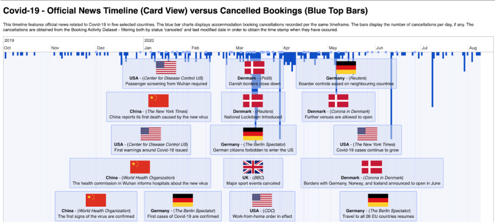
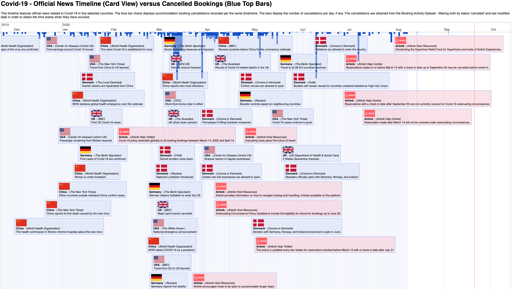

**WORK IN PROGRESS**

The above timeline sets to explore the COVID-19 timeframe at a granular level, from the perspective of international news stories related to the event, and the potential effect on cancellations of Airbnb bookings in Copenhagen. 

The timeline is designed as an interactive prototype, displaying official news from five selected countries, booking cancellation peaks during the COVID-19 timeframe, and the Airbnb response to the events. The final version of the interactive timeline can be accessed via Github [here](https://rebecaapostu.github.io/CovidNewsTimeline/?fbclid=IwAR3jIaxB_DCTmtbCRvJIHqh4EmUSADMzEV6fdECJYXiQOPoNr-fOqQtsM1c). 

## Building the timeline

To reach the final timeline version, three main steps in adding the data were followed in a gradual manner: 

### 1. Collecting the news

Completed in a threefold process that entailed: 

* Geolocating the booking origin to identify the top locations guests travelling to Copenhagen booked from (United States, United Kingdom and Germany). The mapped guest's locations can be accessed in an interactive format through this [link](https://rebecaapostu.github.io/GuestMap/index.html). 

  Apart from countries with highest booking numbers, local news related to Denmark were included on the timeline, alongside with news related to China, as the first country to experience signs of COVID-19. 

* Narrowing the search of official COVID-19 related news to two main aspects: ***travel restrictions*** and ***lockdown measures***.
* Collecting relevant pieces of official news, from sources with highest circulation. 

The selected pieces of news were then set on a timeline, in chronological order. 

### 2. Adding cancellations data

Next, the main bookings dataset has been sampled to only include the bookings marked as 'cancelled'. The data was then crossed with the official news data and set on the same timeline.  

### 3. Integrating Airbnb's response

The final version of the timeline was reached by adding the available online communication related to Airbnb's response to the COVID-19 outbreak.

### Findings

The prototype comes as a result of the research for the MSc. Thesis: Travel Disruption during COVID-19, conducted at the IT University of Copenhagen, as part of the Digital Innovation and Management programme.