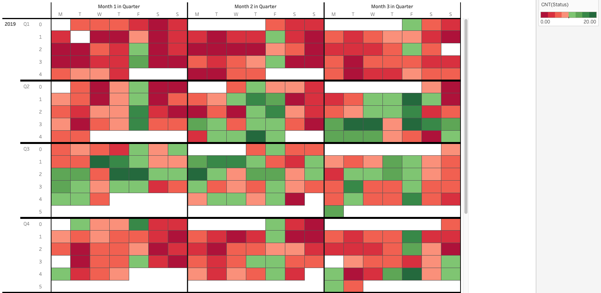
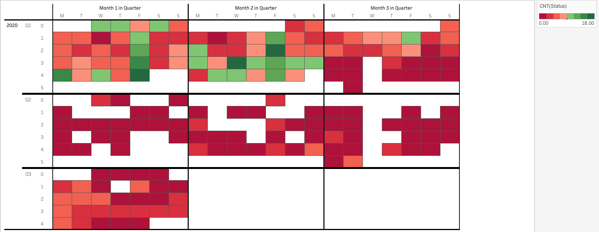
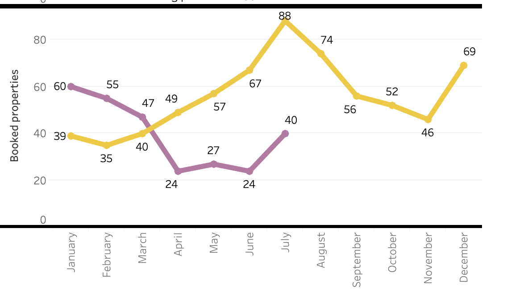
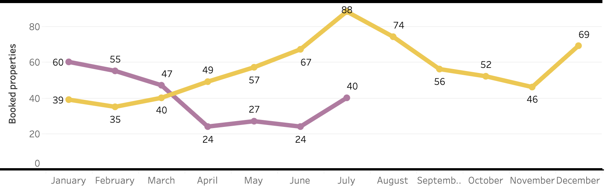
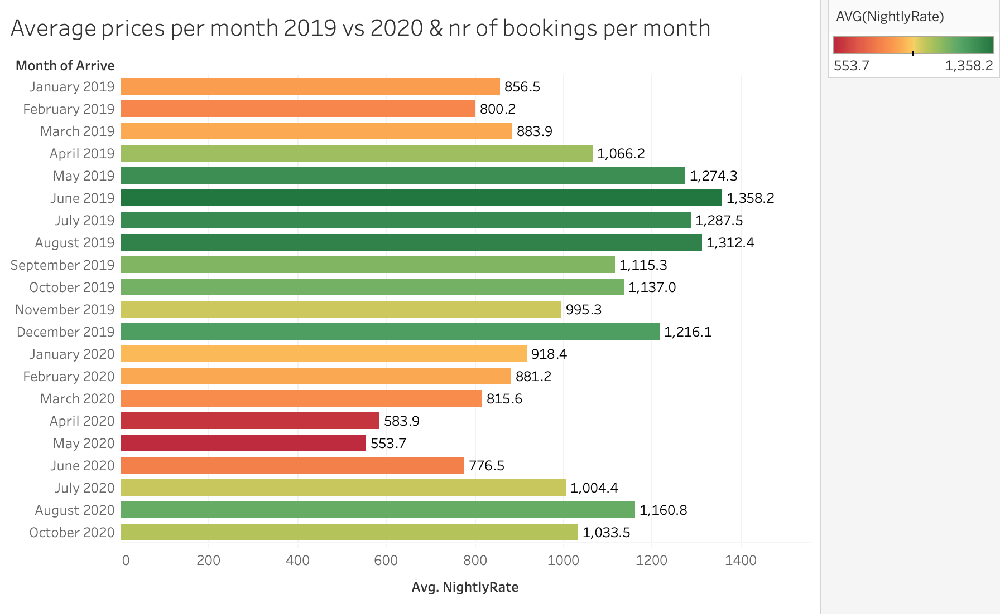
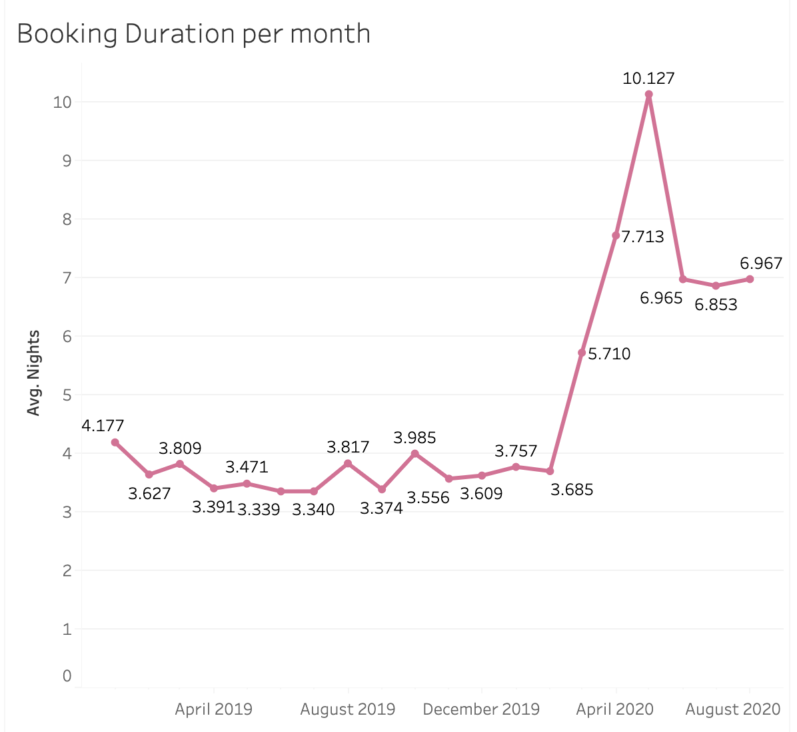
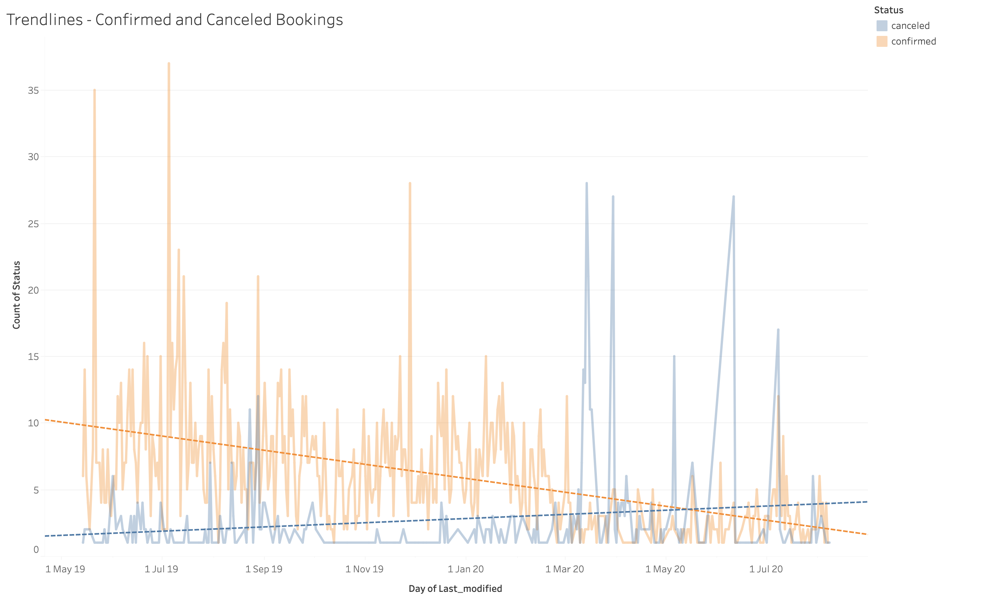

*This article is based on the MSc. Thesis: “Travel Disruption during COVID-19: An exploratory data analysis on Airbnb in Copenhagen”, written by Rebeca Apostu and Aurora Beres.* 

To measure the effects of COVID-19 on Airbnb related booking activities, a comparative analysis was used to highlight trends pre and during the outbreak. The baseline for comparison is the whole of 2019 and statistics are drawn up to July 2020. 

> Statistics over time are extracted in terms of *seasonality trends, quantity of monthly bookings, price fluctuations and booking duration.*

The material resulted from the analysis is published on [Tableau Public](https://public.tableau.com/profile/rebeca.apostu#!/vizhome/TableauAnalytics-CovidThesis/Trendline-confirmedandcanceledbookings).

# Time Series Approach

Broken-down into three main elements, the analysis employed time-stamped data to asses changes over time:

* seasonality and calendar related movements
* trends and patterns over time, to observe the long term direction
* outliers and sudden shifts in the data, by spotting irregularities 

### Seasonal Changes

The [seasonality heat-map calendar](https://public.tableau.com/profile/rebeca.apostu#!/vizhome/TableauAnalytics-CovidThesis/SeasonalityTrends) is assembled on a 8-point colour-code scale, measured by the number of confirmed bookings in a day. Green refers to a higher number of bookings, while red measures the opposite. 

> The 2019 seasonality shows a regular high season from October to March included, and high season from April to September. 



> 2020 booking levels seem to display a 'never-ending'  low season 

It becomes visible that 2020 marks a shift from known seasonality trends - an unprecedented level of days with low (or no) bookings is recorded starting with March.  

With data up to July 2020, the trends show that a high-seasonality has not occurred. Although July shows signs of a recovery, booking levels are below any of the 2019 months. 



## Bookings Quantity

To quantify the shifts above,  bookings are measured in a month-over-month overview. 

The [bookings distribution](https://public.tableau.com/profile/rebeca.apostu#!/vizhome/TableauAnalytics-CovidThesis/BookingDistributionperMonth) per month looks at confirmed bookings and measures them by the month of the arrival date. 

> In the timeframe March-July 2020, a fluctuating decrease of 40 to 90% in booking activities is observed, compared to 2019. 



Apart from a drop in the number of bookings, a drop in the number of properties booked is noticeable, with a drop of 50%.  



**Average Booked Daily Rates** 

In an attempt to measure whether there has been an effect on the daily rates bookings occurred at during COVID-19, an [average daily rate metric](https://public.tableau.com/profile/rebeca.apostu#!/vizhome/TableauAnalytics-CovidThesis/Averagepricespermonth2019vs2020nrofbookingspermonth2) was extracted. 

> Average prices per month in 2020 seem to have taken a turn starting with April, with a 50% decrease. 

Prices begin to show a more positive trend from June 2020. However, when compared with the same months of 2019, they do not reach pre COVID-19 booked rates levels.  



### Booking Duration

In terms of determining whether the change in average booked prices was sustained by a change in [booking duration](https://public.tableau.com/profile/rebeca.apostu#!/vizhome/TableauAnalytics-CovidThesis/BookingDurationpermonth) over the two years, the average nights booked every month were mapped. 

> An exponential shift in the average booking duration starts in March 2020 - from an average of 4 to a peak as high as 10 in May, and a constant average of 6.9 in the following months. 



### Trendline Analysis

Apart from looking at the above effects in confirmed bookings and adjacent metrics, cancellations levels pre and during COVID-19 are assessed. 

Using the date of booking alteration(time-stamp of the action of confirming or cancelling the booking) as index, a measurement of [confirmed booking frequency ](https://public.tableau.com/profile/rebeca.apostu#!/vizhome/TableauAnalytics-CovidThesis/TrendlineMovingAverage-ConfirmedBookings) and a subsequent one on the [cancelled bookings](https://public.tableau.com/profile/rebeca.apostu#!/vizhome/TableauAnalytics-CovidThesis/Trendline-CanceledBookings) were drawn for the entire dataset. 

Crossing the two timelines provided an overview on the behaviour tendency both in confirming or cancelling bookings. 


> In 2020, the two trendlines start to oppositely intersect - while the confirmed bookings follow a negative path, the cancellations follow a positive trend. 



Emphasis, aka italics, with *asterisks* or *underscores*.

Strong emphasis, aka bold, with **asterisks** or **underscores**.

Combined emphasis with **asterisks and *underscores***.

Strikethrough uses two tildes. ~~Scratch this.~~

## Lists

1. First ordered list item
2. Another item
3. Actual numbers don't matter, just that it's a number

* Unordered list can use asterisks
* Or minuses
* Or pluses

## Links

[I'm an inline-style link](https://www.google.com)

[I'm an inline-style link with title](https://www.google.com "Google's Homepage")

[I'm a reference-style link](https://www.mozilla.org)

[I'm a relative reference to a repository file](../blob/master/LICENSE)

[You can use numbers for reference-style link definitions](http://slashdot.org)

Or leave it empty and use the [link text itself](http://www.reddit.com).

URLs and URLs in angle brackets will automatically get turned into links.
http://www.example.com or <http://www.example.com> and sometimes
example.com (but not on Github, for example).

Some text to show that the reference links can follow later.

## Images

<div className="Image__Small">
  
</div>

Lorem Ipsum is simply dummy text of the printing and typesetting industry. Lorem Ipsum has been the industry's standard dummy text ever since the 1500s, when an unknown printer took a galley of type and scrambled it to make a type specimen book. It has survived not only five centuries, but also the leap into electronic typesetting, remaining essentially unchanged. It was popularised in the 1960s with the release of Letraset sheets containing Lorem Ipsum passages, and more recently with desktop publishing software like Aldus PageMaker including versions of Lorem Ipsum. Lorem Ipsum is simply dummy text of the printing and typesetting industry.

## Code and Syntax Highlighting

```javascript
var s = "JavaScript syntax highlighting";
alert(s);
```

```
No language indicated, so no syntax highlighting.
But let's throw in a <b>tag</b>.
```

### JSX

```jsx
import React from "react";
import { ThemeProvider } from "theme-ui";
import theme from "./theme";

export default props => (
  <ThemeProvider theme={theme}>{props.children}</ThemeProvider>
);
```

## Blockquotes

Lorem Ipsum is simply dummy text of the printing and typesetting industry. Lorem Ipsum has been the industry's standard dummy text ever since the 1500s, when an unknown printer took a galley of type and scrambled it to make a type specimen book. It has survived not only five centuries, but also the leap into electronic typesetting, remaining essentially unchanged. It was popularised in the 1960s with the release of Letraset sheets containing.

> Blockquotes are very handy in email to emulate reply text.
> This line is part of the same quote.

Lorem Ipsum is simply dummy text of the printing and typesetting industry. Lorem Ipsum has been the industry's standard dummy text ever since the 1500s, when an unknown printer took a galley of type and scrambled it to make a type specimen book. It has survived not only five centuries, but also the leap into electronic typesetting, remaining essentially unchanged. It was popularised in the 1960s with the release of Letraset sheets containing Lorem Ipsum passages, and more recently with desktop publishing software like Aldus PageMaker including versions of Lorem Ipsum

## Horizontal Rule

Horizontal Rule

Three or more...

- - -

Lorem Ipsum is simply dummy text of the printing and typesetting industry. Lorem Ipsum has been the industry's standard dummy text ever since the 1500s, when an unknown printer took a galley of type and scrambled it to make a type specimen book. It has survived not only five centuries, but also the leap into electronic typesetting, remaining essentially unchanged. It was popularised in the 1960s with the release of Letraset sheets containing Lorem Ipsum passages, and more recently with desktop publishing software like Aldus PageMaker including versions of Lorem Ipsum

- - -

Lorem Ipsum is simply dummy text of the printing and typesetting industry. Lorem Ipsum has been the industry's standard dummy text ever since the 1500s, when an unknown printer took a galley of type and scrambled it to make a type specimen book. It has survived not only five centuries, but also the leap into electronic typesetting, remaining essentially unchanged. It was popularised in the 1960s with the release of Letraset sheets containing Lorem Ipsum passages, and more recently with desktop publishing software like Aldus PageMaker including versions of Lorem Ipsum